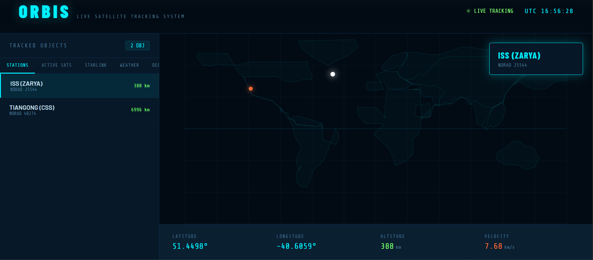

# 🛰 ORBIS — Live Satellite Tracker

> **HackJMI · Future Tech Track**

ORBIS is a real-time satellite tracking web application that visualizes the live positions of hundreds of objects orbiting Earth, including the ISS, Starlink constellation, weather satellites, and tracked debris using actual orbital mechanics.



---

## 🌍 Live Demo

Open `index.html` directly in any browser — **no installation required** for basic use.

For full live TLE data (no CORS issues), run the Flask backend:

```bash
pip install -r requirements.txt
python server.py
# Open http://localhost:5000
```

---

## ✨ Features

- **Real-time orbital propagation** using the SGP4 algorithm (same model used by NASA/NORAD)
- **Live TLE data** fetched directly from [Celestrak](https://celestrak.org) — the authoritative source for satellite orbital elements
- **5 satellite categories**: Space Stations, Active Satellites, Starlink, Weather Sats, Orbital Debris
- **Live telemetry** for any selected object: latitude, longitude, altitude (km), velocity (km/s)
- **UTC clock** synchronized to real time
- Runs entirely in the browser — zero dependencies to install for frontend use

---

## 🔬 How It Works

Satellites are tracked using **Two-Line Element sets (TLEs)** — a standardized data format published by NORAD that encodes a satellite's orbital parameters. These are fetched live from Celestrak's public database.

The **SGP4 (Simplified General Perturbations)** model propagates each satellite's position forward in time from its TLE epoch, accounting for atmospheric drag, Earth's oblateness, and solar/lunar perturbations. This gives us the satellite's position in Earth-Centered Inertial (ECI) coordinates, which we convert to geodetic lat/lon/altitude for display.

This is the same algorithm used in professional space situational awareness systems.

**Libraries used:**
- [`satellite.js`](https://github.com/shashwatak/satellite-js) — SGP4 propagation in JavaScript
- [Celestrak](https://celestrak.org) — Live TLE data source
- [Flask](https://flask.palletsprojects.com) + [flask-cors](https://flask-cors.readthedocs.io) — Backend CORS proxy
- Pure SVG for map rendering — no mapping library needed

---

## 🗂 Project Structure

```
orbis/
├── index.html        # Main app — self-contained frontend
├── server.py         # Flask backend (CORS proxy for Celestrak)
├── requirements.txt  # Python dependencies
├── screenshots/
│   └── demo.png
└── README.md
```

---

## 🚀 Running the Project

### Option 1 — Browser only (quick demo)
```bash
# Just open the file
open index.html   # macOS
# or double-click index.html on Windows/Linux
```
Uses fallback TLE data if Celestrak is unreachable due to CORS.

### Option 2 — With Flask backend (full live data)
```bash
# Install dependencies
pip install -r requirements.txt

# Start server
python server.py

# Open in browser
http://localhost:5000
```

---

## 🔭 Future Scope

- [ ] **Pass prediction** — calculate next visible overhead pass for any location
- [ ] **3D globe** rendering using CesiumJS or Three.js
- [ ] **Orbital path visualization** — draw ground track for next N orbits
- [ ] **Mobile app** using React Native + same SGP4 core
- [ ] **Conjunction alerts** — flag close approaches between objects (debris avoidance)
- [ ] **ISS docking schedule** integration
- [ ] **WebSocket** for multi-user real-time sync

---

## 👤 Team

Built solo

---

## 📄 License

MIT License — free to use, modify, and distribute.

---

> *"The Earth is the cradle of humanity, but mankind cannot stay in the cradle forever."* — Konstantin Tsiolkovsky
